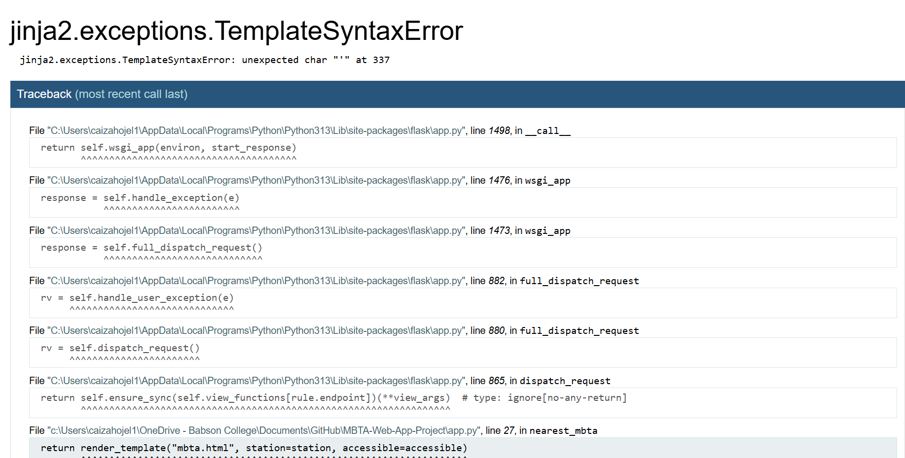
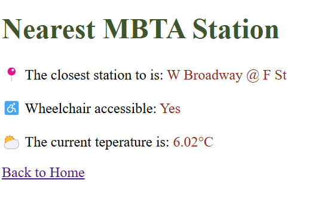
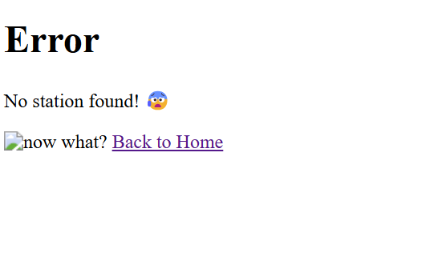

# MBTA-Web-App-Project

### Team Members:
- Vanessa Bravo & Christian Aiza

## Project Overview

The MBTA Web App project aims to provide users with a simple and efficient tool to find the nearest MBTA station and check its accessibility status. Users can enter any location within the Boston area to get real-time information on nearby public transportation. Additionally, the app displays the current temperature at the specified location by integrating the OpenWeather API. The primary objectives of this project were to practice working with APIs, process JSON data, and learn the basics of web development using Flask and HTML. Throughout the project, we also explored error handling, implemented fallback mechanisms, and focused on creating a user-friendly interface.

## Reflection

### Development Process

The development process was a challenging yet rewarding experience. Initially, we faced several issues with debugging and troubleshooting our code, especially when dealing with data from multiple APIs. One of the main challenges was ensuring that the app recognized all locations within the Boston area, as entering a less specific location sometimes gave us no results. We spent time looking up solutions online and used ChatGPT to understand the our problems and to debug errors. The trial-and-error approach helped us improve our debugging skills and gain a better understanding of data structures. Reflecting on the experience, we realized that a structured approach to testing and scoping each function made the process smoother and that starting with detailed tests for each part of the code would have saved us time.

When it came to teamwork, our initial plan was to work separately on our computers and use "Pull Requests" to collaborate on the same file. However, we quickly ran into issues with overlapping code and conflicting updates. Additionally, as beginners, we found that working together would enhance our learning experience. After realizing this, we decided to switch gears and work together on the project from a single computer, which allowed us to brainstorm and debug code side by side. This collaborative approach proved highly beneficial as it gave both of us the chance to learn from each other’s thought processes. Next time, we’d aim to start the assignment earlier to allow time for the optional features and expand our learning even further.

### Learning and Use of AI Tools

From a learning perspective, this project provided valuable insights into web development, particularly in working with Flask and HTML to create basic web applications. We enjoyed creating the HTML layout and seeing our simple web app come to life. Working with APIs was another highlight, as we were able to retrieve and display real-time data, which made the app feel functional and dynamic. Additionally, we found that ChatGPT helped us not only solve errors but also understand why certain functions and libraries were used. This enhanced our learning experience and boosted our efficiency, especially when encountering issues that were difficult to solve. In hindsight, we wish we had known more about handling Git conflicts, as that would have helped us collaborate more effectively in the initial stages. Overall, this project improved our technical skills and introduced us to tools and strategies that we’ll continue to use in future projects.

### Screenshots

_We got a lot of these TemplateSyntaxErrors_

_We could not get the station to print "The closest station to (Boston + placename) is: ..."_

_We couldn't figure out why the image was not showing_
